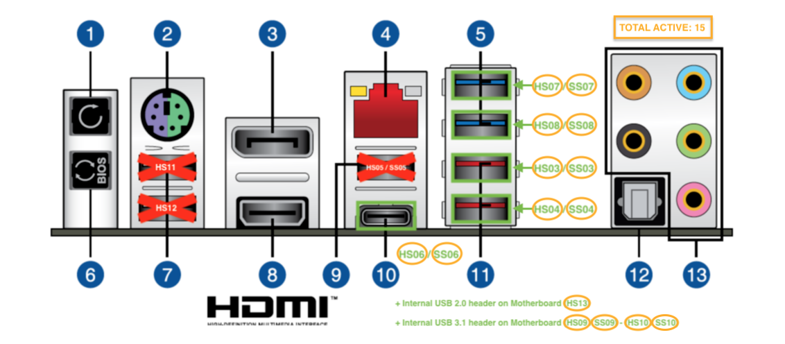

# OpenCore-ASUS-ROG-MAXIMUS-XI-HERO
OpenCore configuration for ASUS ROG MAXIMUS XI HERO and helper script to create EFI directory.


## Table of Contents

   * [Hardware list](#hardware-list)
   * [macOS](#macos)
   * [OpenCore](#opencore)
      * [ACPI](#acpi)
      * [Drivers](#drivers)
      * [Kext](#kext)
      * [Resources](#resources)
      * [Tools](#tools)
   * [BIOS Settings](#bios-settings)
   * [Create EFI directory and files helper script](#create-efi-directory-and-files-helper-script)


## Hardware list

Original hardware selection idea is based on [tonymacx86.com Stork's MyHero II Build](https://www.tonymacx86.com/threads/storks-myhero-ii-build-asus-rog-maximus-z370-hero-x-i7-8700k-amd-rx-580.245074/)

| Type | Item |
| ---- | ---- |
| Motherboard | [Asus ROG MAXIMUS XI HERO ATX LGA1151 Motherboard](https://pcpartpicker.com/product/PGTPxr/asus-rog-maximus-xi-hero-atx-lga1151-motherboard-rog-maximus-xi-hero) |
| CPU | [Intel - Core i9-9900K 3.6 GHz 8-Core Processor](https://pcpartpicker.com/product/jHZFf7/intel-core-i9-9900k-36ghz-8-core-processor-bx80684i99900k) |
| CPU Cooler | [Corsair H60 (2018) 57.2 CFM Liquid CPU Cooler](https://pcpartpicker.com/product/F2rmP6/corsair-h60-2018-572-cfm-liquid-cpu-cooler-cw-9060036-ww) |
| Thermal paste | [ARCTIC MX-4 2019 Edition 4 g Thermal Paste](https://pcpartpicker.com/product/JmYLrH/arctic-mx-4-2019-edition-4-g-thermal-paste-actcp00002b) |
| Memory | [Ballistix Sport LT 64G DDR4, 2400 MHz CL16, BLS4C16G4D240FSB](https://www.amazon.com/gp/product/B01B4F3MNQ) |
| Video Card | [Sapphire Radeon RX 580 8 GB PULSE Video Card](https://pcpartpicker.com/product/y2DzK8/sapphire-radeon-rx-580-8gb-pulse-video-card-11265-05) |
| Wi-Fi + Bluetooth Adapter PCI-E x1 Card | [Fenvi T-919 WiFi + Bluetooth 4.0 BCM94360CD](https://pcpartpicker.com/product/BJ97YJ/fenvi-fv-t919-none-wi-fi-adapter-fv-t919) |
| HDD 1,2 | [Samsung 860 Evo 500 GB 2.5" Solid State Drive](https://pcpartpicker.com/product/6yKcCJ/samsung-860-evo-500gb-25-solid-state-drive-mz-76e500bam) |
| HDD 3 | [Seagate Barracuda 6 TB 3.5" 5400RPM Internal Hard Drive](https://pcpartpicker.com/product/ByL48d/seagate-barracuda-6tb-35-5400rpm-internal-hard-drive-st6000dm003) |
| Firewire | [SYBA Low Profile PCI-Express Firewire Card](https://www.amazon.com/gp/product/B002S53IG8) |
| Power Supply | [Corsair RMx (2018) 750 W 80+ Gold Certified Fully Modular ATX Power Supply](https://pcpartpicker.com/product/79tQzy/corsair-rmx-2018-750w-80-gold-certified-fully-modular-atx-power-supply-cp-9020179-na) |
| Case | [Corsair 450D ATX Mid Tower Case](https://pcpartpicker.com/product/9JvRsY/corsair-case-cc9011049ww) |
| Monitor | [Dell S2415H 23.8" 1920x1080 60 Hz Monitor](https://pcpartpicker.com/product/gZL7YJ/dell-monitor-s2415h) |
| Camera | [Logitech C920S HD Pro Webcam](https://www.amazon.com/gp/product/B07K95WFWM) |

Other accessories:

| Type | Item |
| ---- | ---- |
| Internal Drive Bay Panel | [Chieftec SDC-025 Drive Bay Panel](https://www.amazon.com/Chieftec-SDC-025-Geh%C3%A4use-f%C3%BCr-Speicherlaufwerke/dp/B009DGM4B0) |
| SATA Cable | [SATA III 50cm data cable with 90 degree bent connector](https://www.amazon.co.uk/Gembird-cc-satam-data90-0-5-Cable-Cables-500-Piece/dp/B06XCTW4YZ) |


## macOS

macOS Catalina version 10.15.4 with FileVault 2 enabled.

You may find great installation guide [here](https://dortania.github.io/OpenCore-Desktop-Guide/installer-guide/).


## OpenCore

- [OpenCore 0.5.8](https://github.com/acidanthera/OpenCorePkg/releases/tag/0.5.8)
- [OpenCore Desktop Guide](https://dortania.github.io/OpenCore-Desktop-Guide/)
- [OpenCore Configuration Sanity Checker](https://opencore.slowgeek.com/)


### ACPI

As per [OpenCore Desktop Guide](https://dortania.github.io/OpenCore-Desktop-Guide/config.plist/coffee-lake.html#acpi), compiled SSDTs:

- [SSDT-AWAC.aml](ACPI/SSDT-AWAC.aml)
- [SSDT-EC-USBX.aml](ACPI/SSDT-EC-USBX.aml)
- [SSDT-PLUG.aml](ACPI/SSDT-PLUG.aml)
- [SSDT-PMC.aml](ACPI/SSDT-PMC.aml)

USB map for `USBInjectAll` [SSDT-UIAC.aml](ACPI/SSDT-UIAC.aml). Taken from [this great reddit post](https://www.reddit.com/r/hackintosh/comments/agzo9l/i99900k_asus_rog_maximus_xi_hero_64gb_ram/).




### Drivers

- OpenCore - `OpenCanopy.efi`, `OpenRuntime.efi`
- [OcBinaryData](https://github.com/acidanthera/OcBinaryData) - [HfsPlus.efi](https://github.com/acidanthera/OcBinaryData/blob/master/Drivers/HfsPlus.efi)


### Kext

- [AppleALC 1.4.9](https://github.com/acidanthera/AppleALC/releases/tag/1.4.9)
- [IntelMausi 1.0.2](https://github.com/acidanthera/IntelMausi/releases/tag/1.0.2)
- [Lilu 1.4.4](https://github.com/acidanthera/Lilu/releases/tag/1.4.4)
- [USBInjectAll 2018-1108](https://bitbucket.org/RehabMan/os-x-usb-inject-all/downloads/RehabMan-USBInjectAll-2018-1108.zip)
- [VirtualSMC 1.1.3](https://github.com/acidanthera/VirtualSMC/releases/tag/1.1.3) (`SMCProcessor.kext`, `SMCSuperIO.kext`)
- [WhateverGreen 1.3.9](https://github.com/acidanthera/WhateverGreen/releases/tag/1.3.9)


### Resources

- [OcBinaryData](https://github.com/acidanthera/OcBinaryData) - [Resources/](https://github.com/acidanthera/OcBinaryData/blob/master/Resources)


### Tools

- OpenCore - `CleanNvram.efi` `OpenControl.efi`, `OpenShell.efi`


## BIOS Settings

BIOS [download page](https://www.asus.com/Motherboards/ROG-MAXIMUS-XI-HERO/HelpDesk_BIOS/)
- Version [1401](https://dlcdnets.asus.com/pub/ASUS/mb/LGA1151/ROG_MAXIMUS_XI_HERO/ROG-MAXIMUS-XI-HERO-ASUS-1401.zip)
- Settings [backup](BIOS/V1401.CMO)

Note: After update to 1502 - unable to boot from non-Windows HDD, rolled back to 1401. (09-May-2020)


## Create EFI directory and files helper script

[](https://travis-ci.org/vovinacci/OpenCore-ASUS-ROG-MAXIMUS-XI-HERO)

Requirements:

- [bash](https://www.gnu.org/software/bash/) > 4.0
- [wget](https://www.gnu.org/software/wget/)

Should you use [Homebrew](https://brew.sh/) on macOS, install it with
```
brew install bash wget
```

To create EFI folder, there's no need to clone this repository, just run
```
bash -c "$(curl -fsSL raw.githubusercontent.com/vovinacci/OpenCore-ASUS-ROG-MAXIMUS-XI-HERO/master/create-efi.sh)"
```

This should download all necessary packages and extract files to the `EFI` folder in current directory.

Two things to be done manually before moving everything to actual EFI partition:
- Replace `{{SERIAL}}`, `{{BOARDSERIAL}}` and `{{SMUUID}}` with actual values in `config.plist`. If you don't have one, great example on how to do this could be found [here](https://dortania.github.io/OpenCore-Desktop-Guide/post-install/iservices.html#generate-a-new-serial).
- Replace `{{MACADDRESS}}` with actual `en0` MAC address value in `config.plist`. Another great example on how to do it is [here](https://dortania.github.io/OpenCore-Desktop-Guide/post-install/iservices.html#fixing-en0).

After that, mount EFI partition and copy `EFI` folder there.
